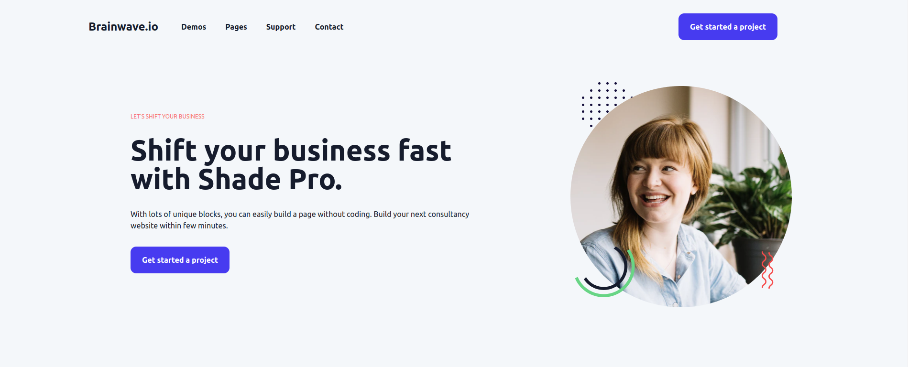

<h1 align="center">
    
   
</h1>

## Sobre

- Projeto realizado para a prática de desenvolvimento Web, com React + Typescript + Tailwindcss.

## Tecnologias

- [React](https://react.dev/)
- [Vitejs](https://vitejs.dev/)
- [TypeScript](https://www.typescriptlang.org/)
- [TailwindCss](https://tailwindcss.com/)
- [Lucide Icons](https://lucide.dev/)

## Download

```bash
# Clone o repositório do Github
$ git clone https://github.com/andrelzlima7/agency-landing-page.git

# Instale as dependências necessárias
$ npm install

# Inicie o projeto
$ npm run dev
```

## Link de acesso a aplicação

- https://agency-landing-page-omega.vercel.app/
